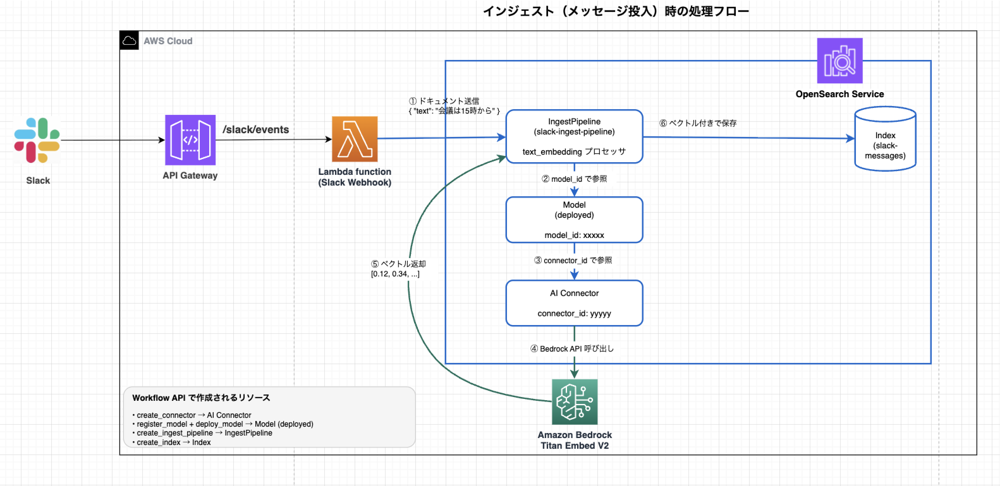
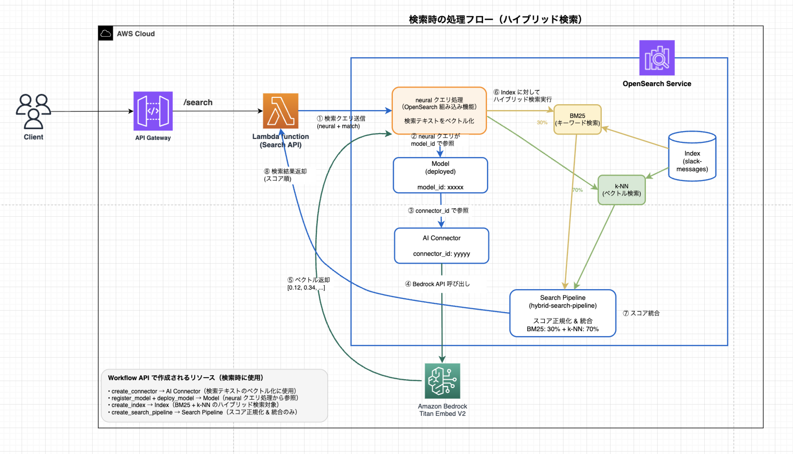

# Slack Hybrid Search Workflow

Sample code for building a hybrid search system using OpenSearch Service AI Connectors with Workflow API.

> **Note**: This repository contains the sample code for the blog post "[OpenSearch Service] Building a Hybrid Search System with AI Connectors using Workflow API".

## Overview

This project enables hybrid search on Slack messages by combining keyword search (BM25) and vector search (k-NN) using OpenSearch Service.

### Features

- **Hybrid Search**: Search by both keyword matching and semantic similarity
- **Workflow API**: Create all resources in a single API call
- **Serverless**: Fully managed services, no EC2 required
- **Japanese Support**: Japanese language embeddings via Amazon Titan Embeddings V2

## Architecture





## Prerequisites

- AWS CLI configured
- Node.js 18.x or later
- pnpm
- Docker (recommended for Lambda Layer build)
- Amazon Bedrock Titan Embeddings V2 enabled

## Quick Start

### 1. CDK Deploy

```bash
# Clone the repository
git clone https://github.com/furuya02/slack-hybrid-search-workflow.git
cd slack-hybrid-search-workflow

# Configure environment variables
cp .env.example .env
# Edit .env with your AWS credentials

# CDK deploy
cd cdk
pnpm install
pnpm cdk bootstrap  # First time only
pnpm cdk deploy
```

After deployment, set the output `DomainEndpoint` and `OpenSearchBedrockRoleArn` in `.env`.

### 2. Create Hybrid Search Resources (Workflow API)

Create all resources in a single API call using OpenSearch Flow Framework.

```bash
cd ..
./scripts/setup-workflow-api.sh
```

Check the workflow status and get the `model_id`:

```bash
DOMAIN_ENDPOINT="<CDK output DomainEndpoint>"
WORKFLOW_ID="<workflow_id from setup-workflow-api.sh output>"

curl -s -X GET "https://${DOMAIN_ENDPOINT}/_plugins/_flow_framework/workflow/${WORKFLOW_ID}/_status" \
    --aws-sigv4 "aws:amz:ap-northeast-1:es" \
    --user "${AWS_ACCESS_KEY_ID}:${AWS_SECRET_ACCESS_KEY}" \
    -H "x-amz-security-token: ${AWS_SESSION_TOKEN}" | jq .
```

Verify `state: "COMPLETED"` and note the `model_id` from `resources_created`.

> **Note**: For the individual API approach, see `setup-hybrid-search.sh`.

### 3. Update Lambda Environment Variables

Set the `model_id` created by the Workflow to the Search Lambda.

```bash
aws lambda update-function-configuration \
    --function-name SlackHybridSearch-Search \
    --environment "Variables={OPENSEARCH_ENDPOINT=<DomainEndpoint>,INDEX_NAME=slack-messages,SEARCH_PIPELINE=hybrid-search-pipeline,MODEL_ID=<model_id>}"
```

> **Important**: Without this step, `hybrid` and `vector` mode searches will not work.

### 4. Test with Sample Data

Load Slack-style sample data (100 messages) and try hybrid search.

```bash
# Load sample data to OpenSearch
./scripts/load-sample-data.sh
```

After loading, test the search API:

```bash
# Get API endpoint
API_ENDPOINT=$(aws cloudformation describe-stacks \
    --stack-name SlackHybridSearchStack \
    --query "Stacks[0].Outputs[?OutputKey=='ApiEndpoint'].OutputValue" \
    --output text)

# Test hybrid search
curl -s -X POST "${API_ENDPOINT}search" \
  -H "Content-Type: application/json" \
  -d '{"query": "Lambda is slow", "mode": "hybrid"}' \
  | jq -r '.results[] | "\(.score | tostring | .[0:6]) | \(.text)"'

# Keyword search
curl -s -X POST "${API_ENDPOINT}search" \
  -H "Content-Type: application/json" \
  -d '{"query": "会議", "mode": "keyword"}' \
  | jq -r '.results[] | "\(.score | tostring | .[0:6]) | \(.text)"'

# Vector search (semantic similarity)
curl -s -X POST "${API_ENDPOINT}search" \
  -H "Content-Type: application/json" \
  -d '{"query": "I want to improve performance", "mode": "vector"}' \
  | jq -r '.results[] | "\(.score | tostring | .[0:6]) | \(.text)"'
```

### 5. Delete Sample Data

Before testing Slack integration, delete the sample data.

```bash
# Delete all documents in the index
curl -s -X POST "https://${DOMAIN_ENDPOINT}/slack-messages/_delete_by_query" \
    --aws-sigv4 "aws:amz:ap-northeast-1:es" \
    --user "${AWS_ACCESS_KEY_ID}:${AWS_SECRET_ACCESS_KEY}" \
    -H "x-amz-security-token: ${AWS_SESSION_TOKEN}" \
    -H "Content-Type: application/json" \
    -d '{"query": {"match_all": {}}}' | jq .

# Verify deletion (should show 0 documents)
curl -s -X GET "https://${DOMAIN_ENDPOINT}/slack-messages/_count" \
    --aws-sigv4 "aws:amz:ap-northeast-1:es" \
    --user "${AWS_ACCESS_KEY_ID}:${AWS_SECRET_ACCESS_KEY}" \
    -H "x-amz-security-token: ${AWS_SESSION_TOKEN}" | jq .
```

### 6. Configure Slack App

#### 6-1. Create Slack App

1. Go to https://api.slack.com/apps and click **Create New App**
2. Select **From scratch** and specify the app name and workspace

#### 6-2. Configure OAuth & Permissions

1. Select **OAuth & Permissions** from the left menu
2. In the **Scopes** section, add the following to **Bot Token Scopes**:
   - `channels:history` - Read channel messages
   - `channels:read` - Read channel info

#### 6-3. Configure Event Subscriptions

1. Select **Event Subscriptions** from the left menu
2. Toggle **Enable Events** to **On**
3. Set **Request URL** to the CDK output `SlackWebhookUrl`
   ```
   https://xxxxxxxxxx.execute-api.ap-northeast-1.amazonaws.com/prod/slack/events
   ```
   > When you enter the URL, Slack will send a verification request, and the Lambda will respond, showing **Verified**.

4. In **Subscribe to bot events**, click **Add Bot User Event** and add `message.channels`
5. Click **Save Changes**

#### 6-4. Install the App

1. Select **Install App** from the left menu
2. Click **Install to Workspace**
3. Review permissions and click **Allow**

#### 6-5. Add App to Channel

1. Open the Slack channel you want to monitor
2. Click the channel name → **Integrations** tab → **Add apps**
3. Add the app you created

### 7. Verify Slack Integration

#### 7-1. Post a Message in Slack

Post a message in the monitored channel:

```
The weekly meeting is at 3 PM today. I'll share the meeting notes later.
```

#### 7-2. Verify Index Registration

```bash
# Check document count
curl -s -X GET "https://${DOMAIN_ENDPOINT}/slack-messages/_count" \
    --aws-sigv4 "aws:amz:ap-northeast-1:es" \
    --user "${AWS_ACCESS_KEY_ID}:${AWS_SECRET_ACCESS_KEY}" \
    -H "x-amz-security-token: ${AWS_SESSION_TOKEN}" | jq .
```

#### 7-3. Verify Posted Message in Search

```bash
# Keyword search
curl -s -X POST "${API_ENDPOINT}search" \
  -H "Content-Type: application/json" \
  -d '{"query": "weekly meeting", "mode": "keyword"}' \
  | jq -r '.results[] | "\(.score | tostring | .[0:6]) | \(.text)"'

# Hybrid search (semantic search)
curl -s -X POST "${API_ENDPOINT}search" \
  -H "Content-Type: application/json" \
  -d '{"query": "meeting schedule", "mode": "hybrid"}' \
  | jq -r '.results[] | "\(.score | tostring | .[0:6]) | \(.text)"'
```

> **Note**: Hybrid search matches synonyms like "weekly meeting" and "meeting schedule".

## Search Modes

| Mode | Description | Use Case |
|------|-------------|----------|
| `hybrid` | BM25 + k-NN combined | General search (recommended) |
| `keyword` | BM25 only | Technical terms, proper nouns |
| `vector` | k-NN only | Semantic similarity, vague expressions |

## Cost Management

### Estimated Costs (24/7 operation)

| Service | Breakdown | Per Day |
|---------|-----------|---------|
| OpenSearch Service | t3.medium.search x 1 instance | ~$1.75 |
| Bedrock Titan | Usage-based | ~$0.01 |
| Lambda + API Gateway | Within free tier | $0.00 |

**Total: ~$1.76/day = ~$12/week**

### Delete Resources

```bash
# Delete all resources after testing
./scripts/cleanup.sh
```

> **Important**: You must delete the domain to stop charges.

## Directory Structure

```
slack-hybrid-search-workflow/
├── cdk/                          # CDK infrastructure code
│   ├── bin/
│   │   └── cdk.ts
│   ├── lib/
│   │   └── slack-hybrid-search-stack.ts
│   └── lambda/
│       ├── slack_webhook/        # Slack event handler
│       │   ├── handler.py
│       │   └── requirements.txt
│       └── search/               # Search API
│           ├── handler.py
│           └── requirements.txt
├── scripts/
│   ├── setup-workflow-api.sh     # Setup using Workflow API (recommended)
│   ├── workflow-template.json    # Workflow definition template
│   ├── setup-hybrid-search.sh    # Setup using individual APIs (reference)
│   ├── load-sample-data.sh       # Load sample data
│   └── cleanup.sh                # Delete resources
├── images/                       # Architecture diagrams
├── README.md
└── README.ja.md
```

## Troubleshooting

### No Search Results

- Confirm workflow setup is complete
- Verify documents are indexed
- Check index status in OpenSearch Dashboards

### Vector Search Not Working

- Verify Bedrock Titan Embeddings V2 is enabled
- Check IAM role has Bedrock permissions

## License

MIT
